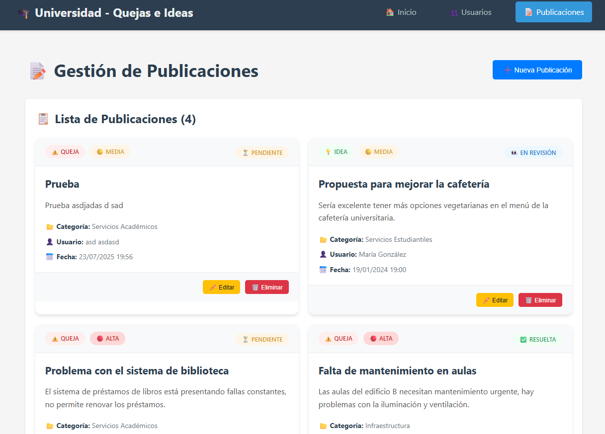

# 🎓 Universidad - Sistema de Quejas e Ideas

Una aplicación web de página única (SPA) desarrollada con Angular para gestionar quejas e ideas de estudiantes universitarios.

## 📋 Descripción del Proyecto

Esta aplicación permite a los estudiantes universitarios publicar quejas e ideas para mejorar los servicios y la experiencia académica. El sistema incluye gestión completa de usuarios y publicaciones con operaciones CRUD.

## 👥 Integrantes y Contribuciones

- **[Javier Zamora]** - Módulo de Usuarios (CRUD completo)
- **[Jostin Moreira]** - Módulo de Publicaciones (CRUD completo)
- **[Javier Zamora]** - Integración y navegación
- **[Jostin Moreira]** - Diseño y estilos

## 🚀 Características Principales

### ✨ Funcionalidades
- **Gestión de Usuarios**: CRUD completo para usuarios universitarios
- **Gestión de Publicaciones**: CRUD completo para quejas e ideas
- **Dashboard**: Estadísticas y publicaciones recientes
- **Navegación SPA**: Enrutamiento sin recarga de página
- **Formularios Reactivos**: Validación en tiempo real
- **Diseño Responsivo**: Compatible con dispositivos móviles

### 🏗️ Arquitectura
- **Componentes**: Estructura modular y reutilizable
- **Servicios**: Gestión centralizada de datos con BehaviorSubject
- **Modelos**: Interfaces TypeScript para tipado fuerte
- **Enrutamiento**: Sistema de navegación con Angular Router

## 🛠️ Tecnologías Utilizadas

- **Angular 17**: Framework principal
- **TypeScript**: Lenguaje de programación
- **RxJS**: Programación reactiva
- **Angular Reactive Forms**: Formularios con validación
- **CSS3**: Estilos y diseño responsivo
- **Angular Router**: Navegación SPA

## 📦 Instalación y Ejecución

### Prerrequisitos
- Node.js (versión 16 o superior)
- NPM o Yarn
- Angular CLI (\`npm install -g @angular/cli\`)

### Pasos de Instalación

1. **Instalar dependencias**
   \`\`\`bash
   npm install
   \`\`\`

2. **Ejecutar la aplicación**
   \`\`\`bash
   ng serve
   \`\`\`

3. **Abrir en el navegador**
   Navegar a \`http://localhost:4200\`

## 📱 Evidencias de Funcionamiento

### 🏠 Página de Inicio
- Dashboard con estadísticas del sistema
- Publicaciones recientes
- Accesos rápidos a las funcionalidades principales

### 👥 Gestión de Usuarios
- Lista completa de usuarios registrados
- Formulario para crear/editar usuarios
- Validaciones en tiempo real
- Estados activo/inactivo

### 📝 Gestión de Publicaciones
- Vista de tarjetas para publicaciones
- Filtros por tipo (queja/idea), estado y prioridad
- Formulario completo con validaciones
- Categorización por áreas universitarias

## 🗂️ Estructura del Proyecto

\`\`\`
src/
├── app/
│   ├── components/
│   │   ├── home/                 # Página principal
│   │   ├── usuarios/             # Gestión de usuarios
│   │   └── publicaciones/        # Gestión de publicaciones
│   ├── models/
│   │   ├── usuario.interface.ts  # Modelo de usuario
│   │   └── publicacion.interface.ts # Modelo de publicación
│   ├── services/
│   │   ├── usuario.service.ts    # Servicio de usuarios
│   │   └── publicacion.service.ts # Servicio de publicaciones
│   ├── app-routing.module.ts     # Configuración de rutas
│   ├── app.component.ts          # Componente raíz
│   └── app.module.ts             # Módulo principal
├── assets/                       # Recursos estáticos
└── styles.css                    # Estilos globales
\`\`\`

## 🎯 Funcionalidades por Módulo

### Módulo de Usuarios
- ✅ Crear nuevo usuario
- ✅ Listar todos los usuarios
- ✅ Editar información de usuario
- ✅ Eliminar usuario
- ✅ Validaciones de formulario
- ✅ Estados activo/inactivo

### Módulo de Publicaciones
- ✅ Crear nueva publicación (queja/idea)
- ✅ Listar todas las publicaciones
- ✅ Editar publicación existente
- ✅ Eliminar publicación
- ✅ Categorización por áreas
- ✅ Estados de seguimiento
- ✅ Niveles de prioridad

## 🔧 Configuración de Desarrollo

### Estructura de Datos
Los datos se almacenan en memoria usando BehaviorSubject para simular una base de datos. En un entorno de producción, estos servicios se conectarían a una API REST.

### Validaciones Implementadas
- **Usuarios**: Nombre, apellido, email válido, carrera, semestre
- **Publicaciones**: Título mínimo 5 caracteres, contenido mínimo 10 caracteres

